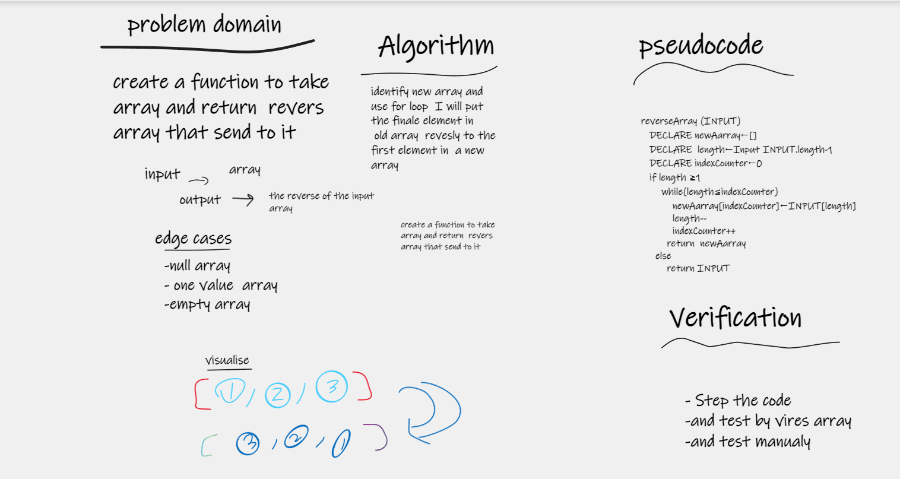

# Reverse an Array
 function called reverseArray which takes an array as an argument. Without utilizing any of the built-in methods available to your language, return an array with elements in reversed order.

## Whiteboard Process

## Approach & Efficiency
i write the problem , viow the algorathems and show my seluation by pseudcode and visual my soluation by Using the Loop and Array to solve this problem took me 10 minutes