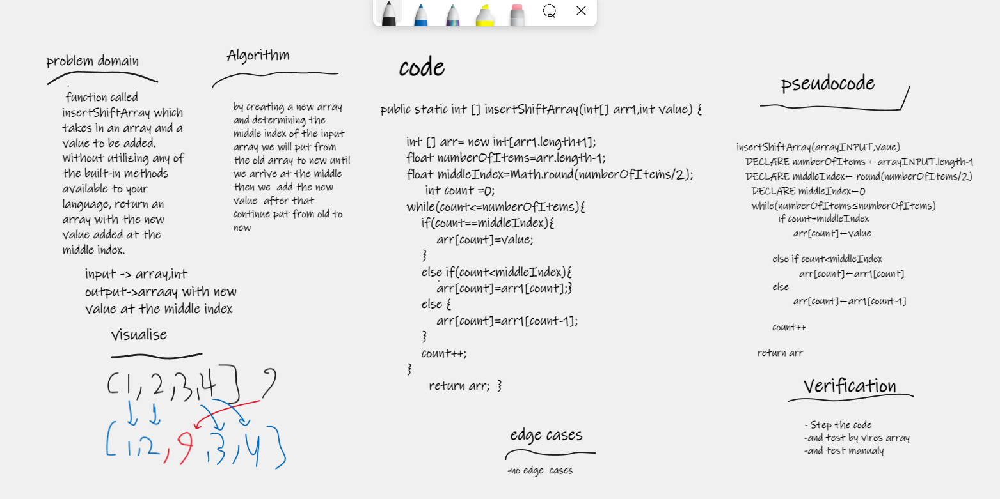

# Reverse an Array
 function called insertShiftArray which takes in an array and a value to be added. Without utilizing any of the built-in methods available to your language, return an array with the new value added at the middle index.

## Whiteboard Process

## Approach & Efficiency
i write the problem , viow the algorathems and show my seluation by pseudcode , code and visual my soluation by Using the Loop and Array to solve this problem took me 25 minutes