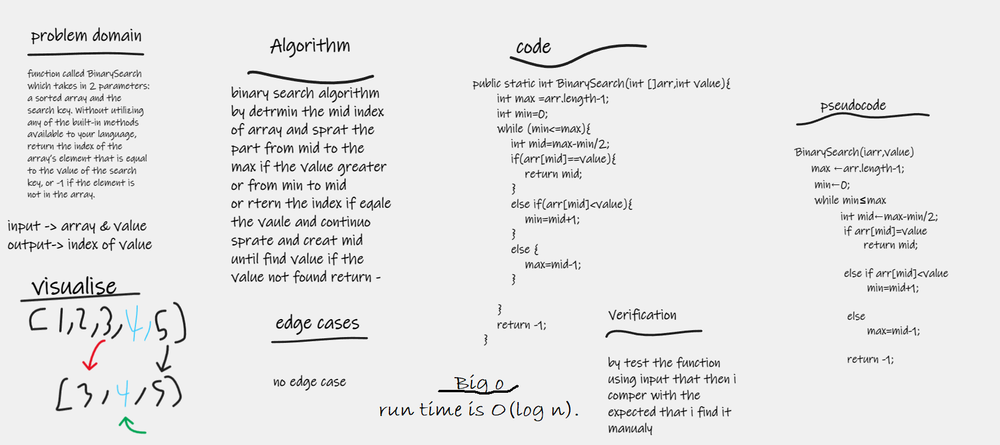

#  search algorithm
function called BinarySearch which takes in 2 parameters: a sorted array and the search key. Without utilizing any of the built-in methods available to your language, return the index of the array’s element that is equal to the value of the search key, or -1 if the element is not in the array.

## Whiteboard Process

## Approach & Efficiency
i write the problem , viow the algorathems and show my seluation by pseudcode , code and visual my soluation by Using the search algorithm to solve this problem took me 25 minutes