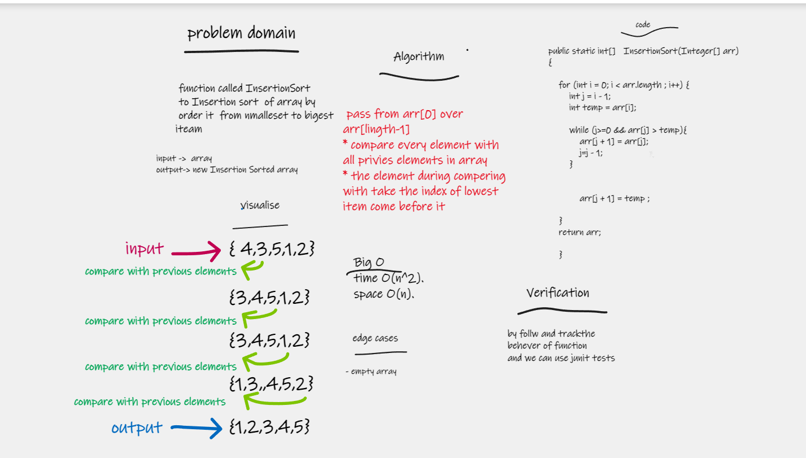

# Challenge Summary
function called InsertionSort
to Insertion sort  of array by
order it  from nmalleset to bigest iteam

## Whiteboard Process

## Approach & Efficiency
Big O
time O(n^2).
space O(n).
## Solution
pass from arr[0] over arr[lingth-1]
* compare every element with all privies elements in array
* the element during compering
  with take the index of lowest item come before it 