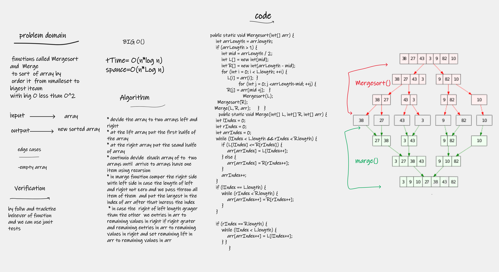

# MergeSort
functions called Mergesort and  Merge
to sort  of array by
order it  from nmalleset to bigest iteam
with big O less than O^2

## Whiteboard Process

## Approach & Efficiency
i write the problem , viow the algorathems  , code and visual my soluation  to solve this problem took me 2 hours
the big O is o(n*log n)

## Solution
- devide the array to two arrays left and right
- at the lift array put the first halfe of the array
- at the right array put the seand halfe of array
- continuio devide  ehach array of to  two arrays until  arrive to arrays have one item using recursion
- in marge function comper the right side with left side in case the length of left and right not zero and we pass threoo all item of them  and put the largest in the index of arr after that incress the index
- in case the  right of left length grager than the other  we entries in arr to remaining values in right if right grater
  and remaining entries in arr to remaining values in right and set remaining lift in arr to remaining values in arr

