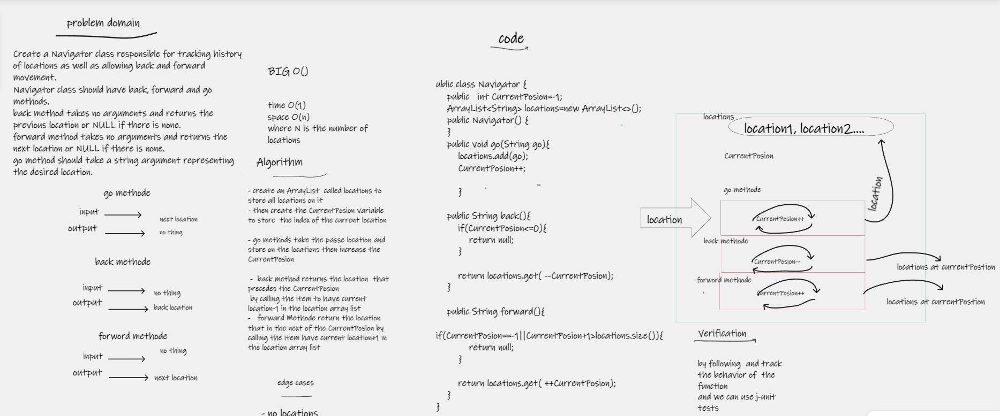

# Navigator
- Create a Navigator class responsible for tracking history of locations as well as allowing back and forward movement.
Navigator class should have back, forward and go methods.
- back method takes no arguments and returns the previous location or NULL if there is none.
- forward method takes no arguments and returns the next location or NULL if there is none.
- go method should take a string argument representing the desired location.

