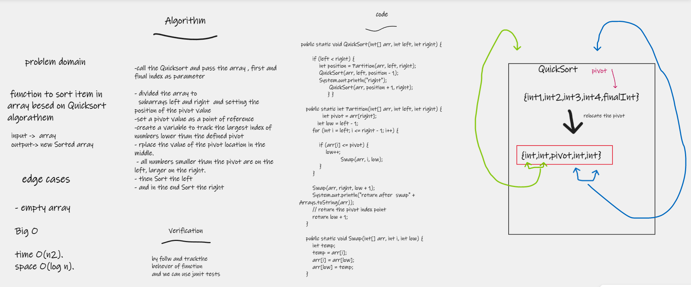

# QuickSort
function to sort item in array besed on Quicksort algorathem
- input ->  array
- output-> new Sorted array

## Whiteboard Process

## Approach & Efficiency
i write the problem , viow the algorathems  , code and visual my soluation  to solve this problem took me 2 hours
the big O is for time O(n2) and
 O(log n) for space.

## Solution
- call the Quicksort and pass the array , first and final index as parameter

- divided the array to
  subarrays left and right  and setting the position of the pivot value
  - set a pivot value as a point of reference
  - create a variable to track the largest index of numbers lower than the defined pivot
- rplace the value of the pivot location in the middle.
- all numbers smaller than the pivot are on the left, larger on the right.
- then Sort the left
- and in the end Sort the right