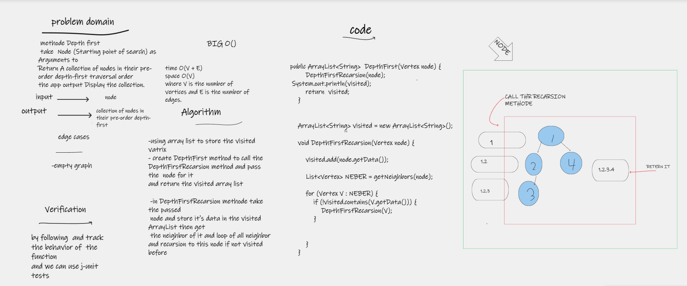

# Challenge Summary
 methode Depth first
 take  Node (Starting point of search) as  Arguments to
Return A collection of nodes in their pre-order depth-first traversal order
the app output Display the collection.

## Whiteboard Process

## Approach & Efficiency
- time O(V + E)
- space O(V)
- where V is the number of vertices and E is the number of edges.
## Solution
### how to run code 
- create graph
- add node to it
- create edges
- call the methode by pass the root of graph as argument
