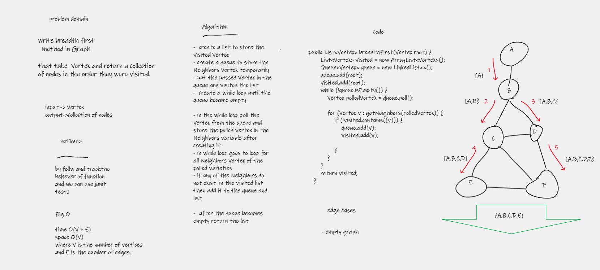

# Challenge Summary
Write breadth first
method in Graph

that take  Vertex and return a collection of nodes in the order they were visited.

## Whiteboard Process

## Approach & Efficiency
- time O(V + E)
- space O(V)
- where V is the number of vertices and E is the number of edges.
## Solution
### how to run code 
- create graph
- add node to it
- create edges
- call the methode by pass the root of graph as argument
