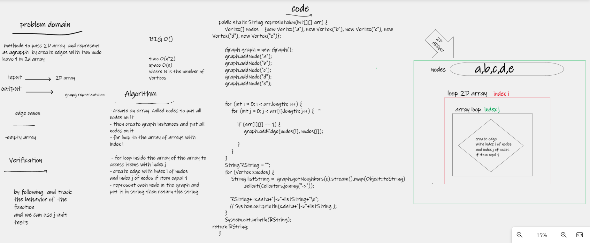

# Challenge Summary
methode to pass 2D array  and represent as agrapph  by create edges with two node have 1 in 2d array
## Whiteboard Process

## Approach & Efficiency
time O(n*2)
space O(n)
where N is the number of vertices
## Solution
### how to run code 
- create graph
- add node to it
- create edges
- call the methode by pass the root of graph as argument
