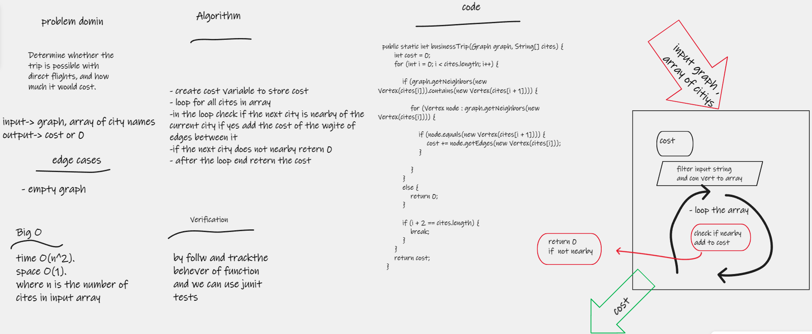

# Challenge Summary
Determine whether the trip is possible with direct flights, and how much it would cost.

## Whiteboard Process

## Approach & Efficiency
- big O
- time O(n^2).
- space O(1).
- where n is the number of cites in input array
## Solution
### how to run code 
- create graph
- add node to it
- create edges
- call the methode by pass the   graph  and array of cities as argument
