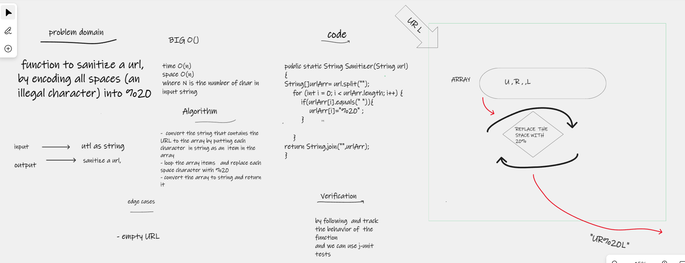

# Challenge Summary
function to sanitize a url, by encoding all spaces (an illegal character) into %20

## Whiteboard Process

## Approach & Efficiency
### Big O
- Time->O(n)
- space ->O(n)
* where __n__ the number of char in input url
## Solution
- convert the string that contains the URL to the array by putting each character  in string as an  item in the array
- loop the array items   and replace each space character with %20
- convert the array to string and return it