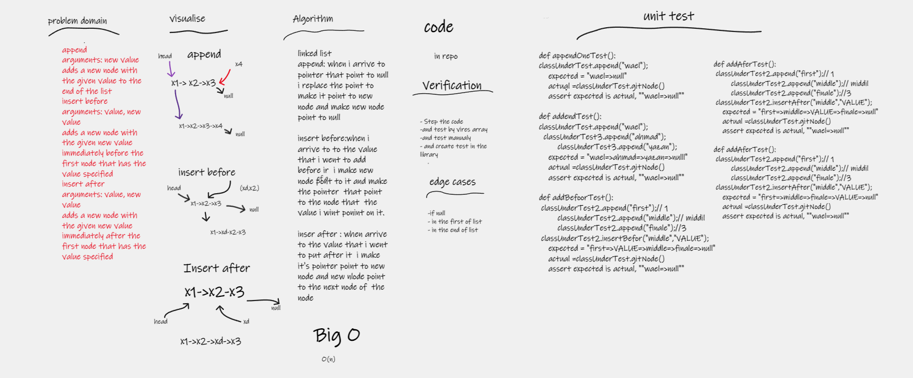

# linked-list-insertions

Write the following methods for the Linked List class:

append
arguments: new value
adds a new node with the given value to the end of the list
insert before
arguments: value, new value
adds a new node with the given new value immediately before the first node that has the value specified
insert after
arguments: value, new value
adds a new node with the given new value immediately after the first node that has the value specified

## Whiteboard Process

## Approach & Efficiency
i used the linked list data structuer , deuto the challenge based on it Big O => O(n)
<!-- What approach did you take? Why? What is the Big O space/time for this approach? -->

## Solution
crat new linked list add you can put item on it using append methode and you  and you can add befor and after any value wants