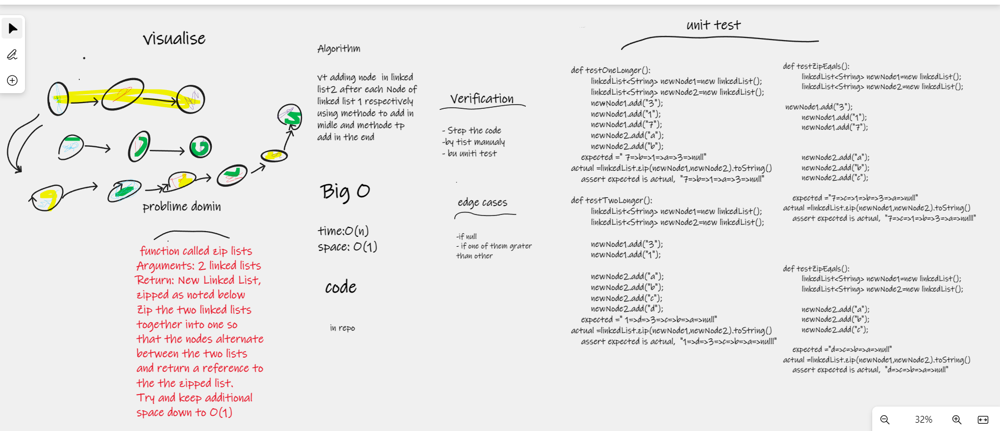

# linked-list-zip
a function called zip lists
Arguments: 2 linked lists
Return: New Linked List, zipped as noted in visale in photo
Zip the two linked lists together into one so that the nodes alternate between the two lists and return a reference to the the zipped list.
Try and keep additional space down to O(1)

## Whiteboard Process

## Approach & Efficiency
i used the linked list data structuer , deuto the challenge based on it Big O  time compixity => O(n)
and Big O  space compixity => O(1)

## Solution
vt adding node  in linked list2 after each Node of linked list 1 respectively 
using methode to add in midle and methode tp add in the end

