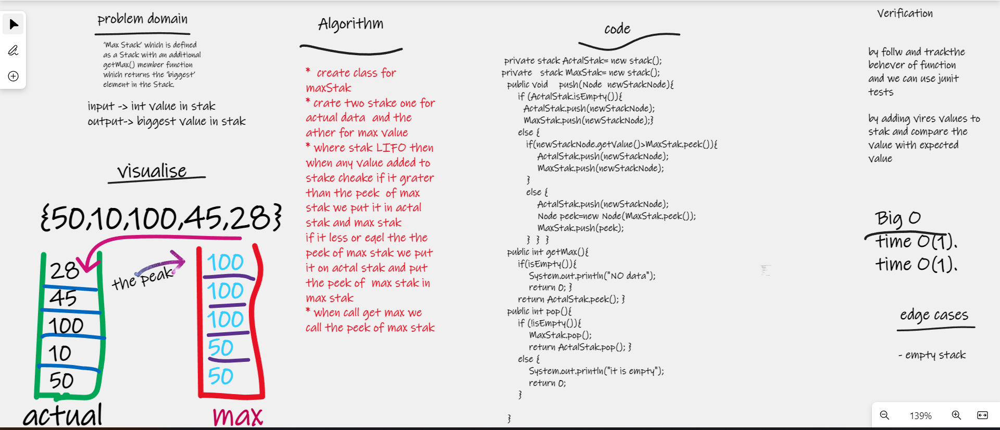

# Max Stack
‘Max Stack’ which is defined as a Stack with an additional getMax() member function which returns the ‘biggest’ element in the Stack.

## Whiteboard Process

## Approach & Efficiency
i write the problem , viow the algorathems  , code and visual my soluation  to solve this problem took me 2 hours 
the big O is o(1)

## Solution
- create class for maxStak
- crate two stake one for  actual data  and the ather for max value
- where stak LIFO then
  when any value added to stake cheake if it grater
  than the peek  of max stak we put it in actal stak and max stak
  if it less or eqel the the peek of max stak we put it on actal stak and put the peek of  max stak in max stak
- when call get max we call the peek of max stak