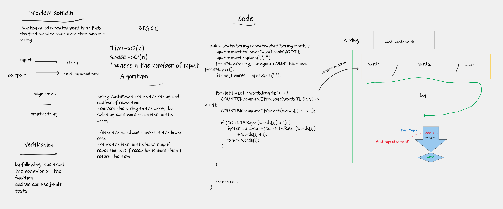

# Challenge Summary
function called repeated word that finds the first word to occur more than once in a string

## Whiteboard Process

## Approach & Efficiency
### Big O
- Time->O(n)
- space ->O(n)
* where __n__ the number of words in the input string
* 
## Solution

- using hashMap to store the string and number of repetition
- convert the string to the array  by splitting each word as an item in the array

- filter the word and convert it the lower case
- store the item in the hash map if repetition is 0 if reception is more than 1 return the item
