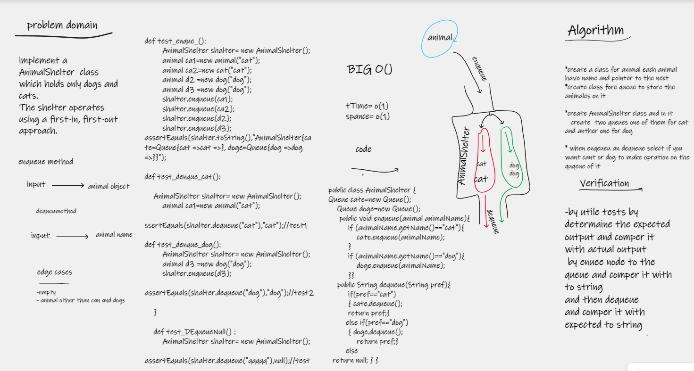

# stack-queue-animal-shelter

 implement a AnimalShelter  class  which holds only dogs and cats.
The shelter operates using a first-in, first-out approach.

## Whiteboard Process

## Approach & Efficiency
i write the problem , viow the algorathems  , code and visual my soluation  to solve this problem took me 2 hours minutes
the big O is o(1)

## Solution
by adding animal (dig and cat ) to animal-shelter by creating object of animal aftar that you can add the animal to the shelter