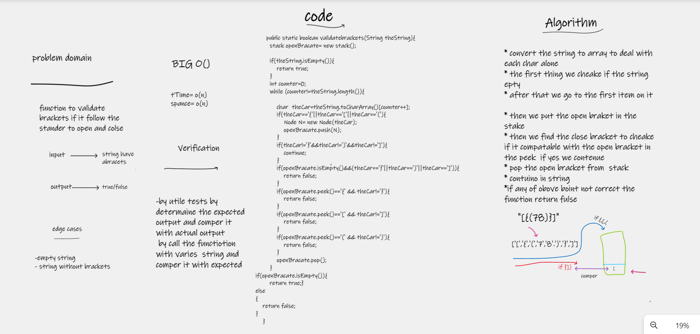

# stack-queue-brackets

function to validate brackets if it follow the stander to open and colse

## Whiteboard Process

## Approach & Efficiency
i write the problem , viow the algorathems  , code and visual my soluation  to solve this problem took me 2 hours minutes
the big O is o(n) for spanse and time

## Solution
* convert the string to array to deal with each char alone
* the first thing we cheake if the string epty
* after that we go to the first item on it 

* then we put the open braket in the stake
* then we find the close bracket to cheake if it compatable with the open bracket in the peek  if yes we contenue 
* pop the open bracket from  stack 
* contuino in string
*if any of obove boint not correct the function return fulse