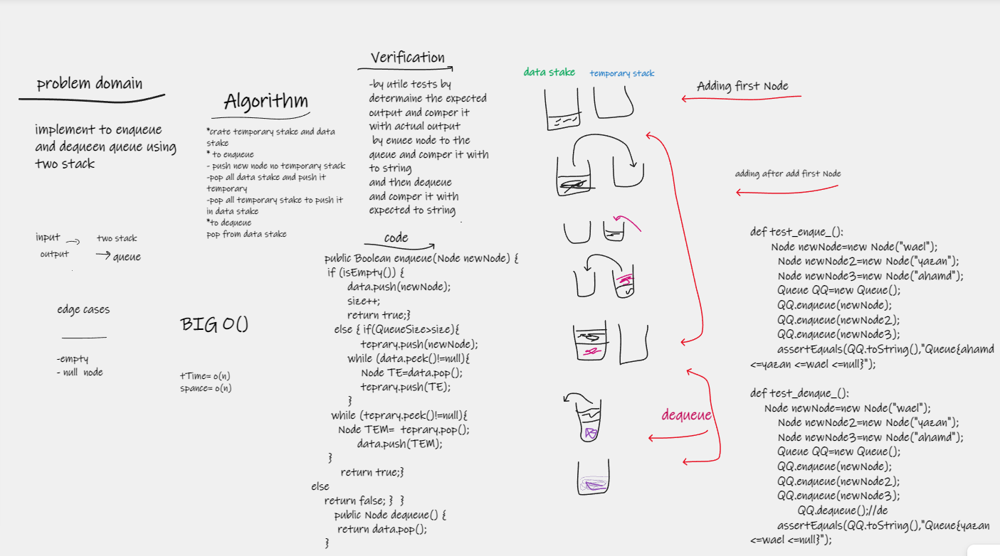

# stack-queue-pseudo
implement to enqueue and dequeue queue using two stack

## Whiteboard Process

## Approach & Efficiency
it takes two horse to solve it
big O for time and space is o(n)

## Solution
*crate temporary stake and data stake
* to enqueue
- push new node no temporary stack
  -pop all data stake and push it temporary
  -pop all temporary stake to push it in data stake
  *to dequeue
  pop from data stake

