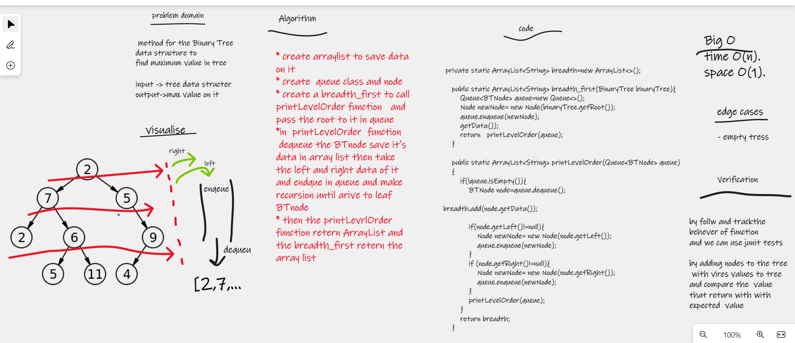

# tree-breadth-first

 method for the Binary Tree  data structure to
find maximum value in tree

## Whiteboard Process

## Approach & Efficiency
i write the problem , viow the algorathems  , code and visual my soluation  to solve this problem took me 
3 hours minutes the big O is o(1) for space and o(n) for time

## Solution
* create arraylist to save data on it
* create  queue class and node
* create a breadth_first to call printLevelOrder function   and pass the root to it in queue
*in  printLevelOrder  function  
 dequeue the BTnode save it's data in array list then take the left and right data of it and endque in queue and make recursion until arive to leaf BTnode
* then the printLevrlOrder function retern ArrayList and the breadth_first retern the array list