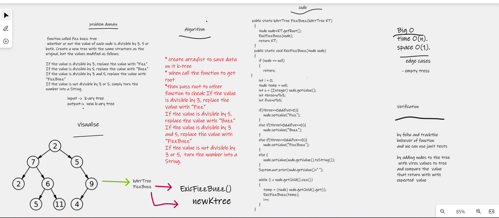

# fizz buzz tree
function called fizz buzz tree
 whether or not the value of each node is divisible by 3, 5 or both. Create a new tree with the same structure as the original, but the values modified as follows:

## Whiteboard Process

## Approach & Efficiency
i write the problem , viow the algorathems  , code and visual my soluation  to solve this problem took me 
3 hours minutes the big O is o(1) for space and o(n) for time

## Solution
* create arraylist to save data on it k-tree
* when call the function to get root 
*then pass root to other function to cheak If the value is divisible by 3, replace the value with “Fizz”
If the value is divisible by 5, replace the value with “Buzz”
If the value is divisible by 3 and 5, replace the value with “FizzBuzz”
If the value is not divisible by 3 or 5,  turn the number into a String.
