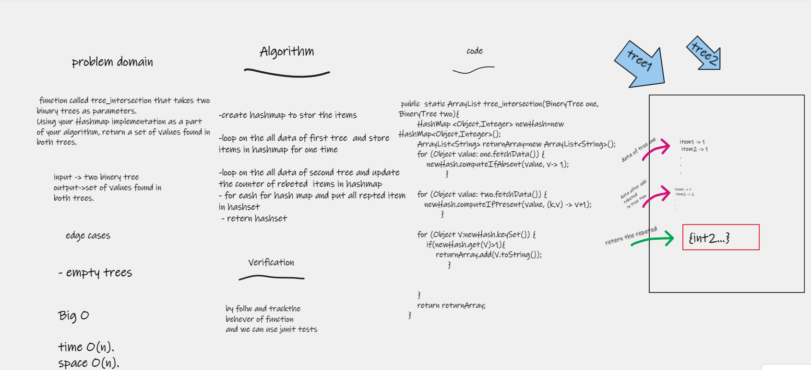

# Challenge Summary
function called tree_intersection that takes two binary trees as parameters.
Using your Hashmap implementation as a part of your algorithm, return a set of values found in both trees.

## Whiteboard Process

## Approach & Efficiency
### Big O

- time O(n).
- space O(n).
## Solution
- create hashmap to store the items

- loop on the all data of first tree  and store items in hashmap for one time

- loop on the all data of second tree and update the counter of repeated  items in hashmap
- for each for hash map and put all repeated item in hashset
-  return hashset