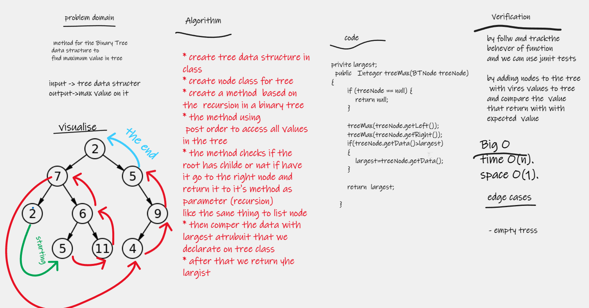

# Challenge Summary
method for the Binary Tree  data structure to
find maximum value in tree

## Whiteboard Process

## Approach & Efficiency
Big O
time O(n).
space O(1).

## Solution
* create tree data structure in
* create node class for tree
* create a method  based on the  recursion in a binary tree
* the method using
  post order to access all values in the tree
* the method checks if the  root has childe or nat if have   it go to the right node and return it to it's method as parameter (recursion)
  like the sane thing to list node
* then comper the data with  largest atrubuit that we declarate on tree class
* after that we return yhe largist
